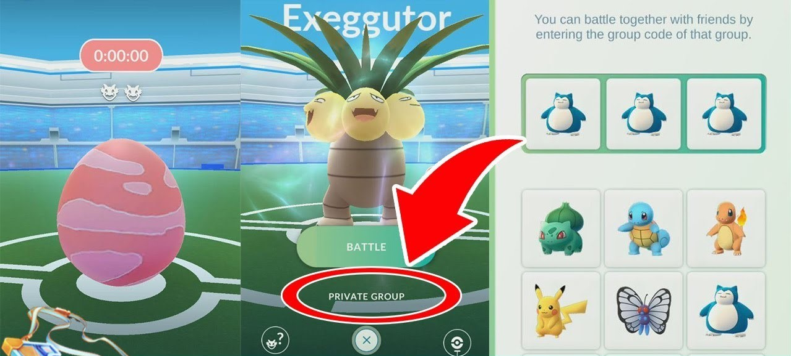
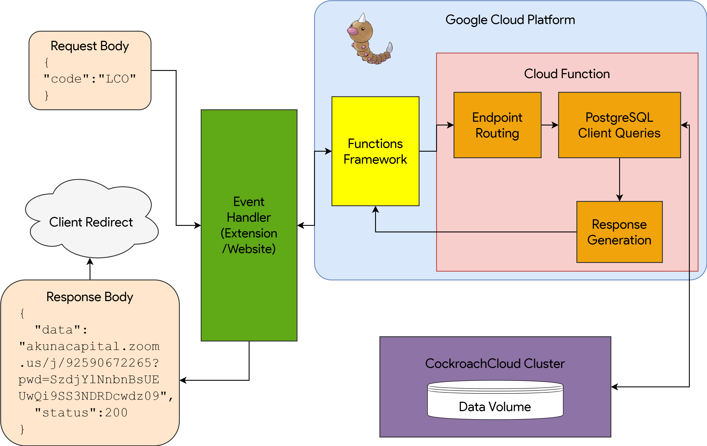

# Cache'em all - A Social URL Shortener
##### 🥇 Winner @ UofT Newhacks

This Google Chrome extension transforms long URLs into memorable sequences of Pokémon images. Share your sequences with friends across the room or across the world for easy access, even if they don't have the extension installed.

## Overview

When you activate Cache'em all, you are tasked to select with replacement any mix of 9 Pokémon you'd like your URL to map to. Once you're satisfied, clicking `Generate` makes a one-time request to retrieve the currently active tab in your browser, which along with your Pokémon are directed to our database for bookkeeping.
- Each choice is represented in our system as a single character, and we provide visual feedback of this format to service those who maybe haven't touched their Nintendo DS in a while. All the Pokémon we curated start with different letters of the alphabet to prevent any confusion (and collisions for that matter)!
- We technically cap sequences and URLs at 255 characters. This actually means, given an adequate amount of persistent users, there are 1+9+81+729+⋯+9255 = (9256-1)/8 valid possibilities of sequences that can be represented in our system ([Proof](http://mikestoolbox.com/powersum.html)). We don't intend for anyone to exceed 7 at a time, but leave that choice up to the individual.

## Why Pokémon though?

The inspiration for this project comes from a feature in the global phenomenon that was Pokémon GO. Battling powerful foes, in limited-time battles coined as raids, required help from physically nearby players. All one had to do to invite others to their raid group was communicate an ordered triplet of popular Pokémon. Our idea was to emulate this experience to make our Internet consumption fun and convenient, whilst honing our skills in system design.

## Implementation

### Tech Stack

- Language: JavaScript and jQuery.
- Framework: Website hosted on Github pages and uses Bootstrap.
- Server-side: Google Cloud Functions, run with Ubuntu and Node.js 12 and technically serverless.
- Containerization: Google Cloud Platform.
- Database: CockroachDB, essentially a dialect of PostgreSQL, a common relational database.

### System Design/Architecture

## How do I use this?

Download this repository as a zip and unzip it. Then, navigate to chrome://extensions, enable developer mode, and click on "Load Unpacked". Select the unzipped file in your directory, and well, poggers, you're set to cache'em all!

---
Collaborators: Edward Lee, Eugene Jang, Jisahn Kim
